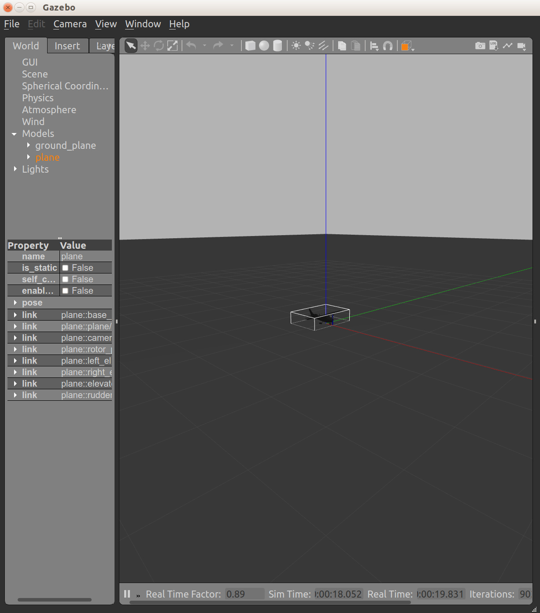
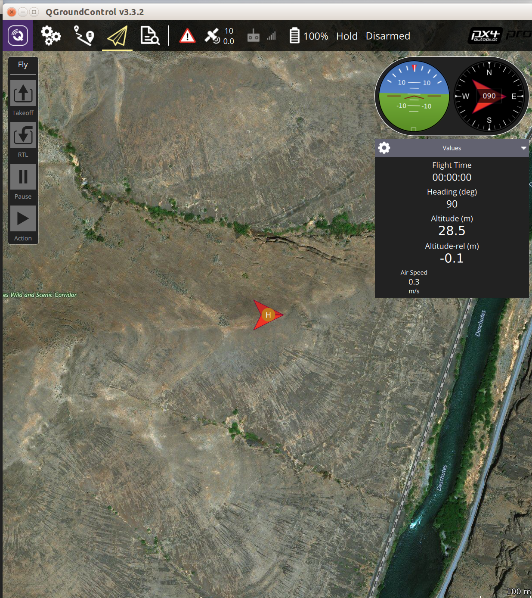
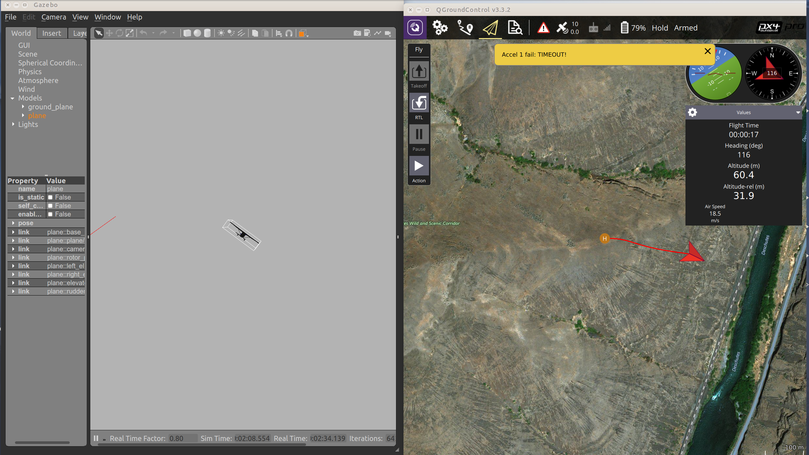
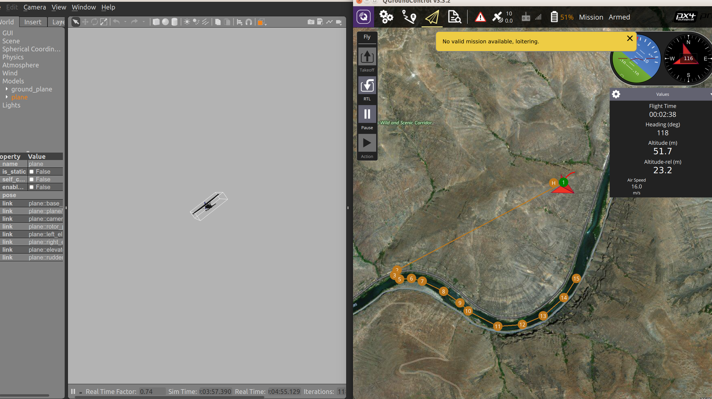

# pixhawk-proxy
OpenUxAS service communicating with Pixhawk autopilot via MAVLINK

# Supported systems
Tested on Ubnutu 18.04

# Prerequisities

Assuming a fresh, minimal Ubuntu 18.04 install.

```
# Install a few random packages.
# curl              used below to pull install scripts from web
# build-essential   Installs make, g++, gcc
# clang-format      Formats generated protobuf files
# meson             Creates build scripts for ninja
# ninja             Builds UxAS
# ant               Builds java Apps
# rustc             Rust support for a couple repos.
sudo apt install -y curl
sudo apt install -y build-essential
sudo apt install -y clang-format
sudo apt install -y meson
sudo apt install -y ninja
sudo apt install -y ant
sudo apt install -y rustc

# Only run this one once. It will warn you before running twice that second runs
# may mess it up.
curl -sSL http://get.gazebosim.org | sh

# Must be nightly because developer used features only availible in the nightly branch
# NOTE: Nightly features either make it into the main rust branch or they are dropped.
#       If the [rust](https://rustup.rs/) programs can't compile at a later date it may be that the features
#       he used were dropped rather than integrated into the stable Rust release.
rustup install nightly
rustup default nightly
rustup update nightly
```

# Installation

Use the following handy script (save it as for example `install_rust_repos.sh`):

## Clone repositories
```bash
#!/bin/bash
echo "Clone Rust repos from gitlab-int"
git clone https://github.com/GaloisInc/lmcp_sentinelizer.git
git clone https://github.com/GaloisInc/uxas_attribute_message.git
git clone https://github.com/GaloisInc/mavlink2protobuf_service.git
cd mavlink2protobuf_service && git checkout 924be69 && cd ../
# git clone https://github.com/GaloisInc/pixhawk-proxy.git # TODO: uncomment and select right commit

echo "Clone PX4 Firmware"
git clone -b uxas_master https://github.com/GaloisInc/Firmware.git
cd Firmware && git checkout 658b957888 && cd ../

echo "Download QGroundControl"
wget https://s3-us-west-2.amazonaws.com/qgroundcontrol/latest/QGroundControl.AppImage && chmod +x ./QGroundControl.AppImage

echo "Clone UxAS (Galois fork, pixhawk branch)"
git clone --single-branch --branch pixhawk https://github.com/GaloisInc/OpenUxAS

echo "Clone AFRL LMCP generator"
git clone https://github.com/afrl-rq/LmcpGen.git

echo "Clone OpenAMASE"
git clone https://github.com/afrl-rq/OpenAMASE.git
```

## Build packages 

```
bash install_prerequisites.sh 

echo "Run LMCP Gen"
bash RunLmcpGen.sh

echo "Build OpenUxAS"
./rm-external
./prepare
meson build --buildtype=release
ninja -C build all
cd ..

echo "Getting Gazebo and ROS"
# NOTE: there is probably a better way to builds this, will have to look into it
wget https://raw.githubusercontent.com/PX4/Devguide/master/build_scripts/ubuntu_sim_ros_gazebo.sh
source ubuntu_sim_ros_gazebo.sh

echo "Done"
cd ..
```

And then:
```
$ chmod +x install_rust_repos.sh
$ ./install_rust_repos.sh
```

And wait. The Gazebo/Ros install will likely end with some kind of error, but that is expected. Also, `ubuntu_sim_ros_gazebo.sh` installer appends your `~/.bashrc` file, so you might want to delete these two lines from `~/.bashrc`:
```
source /opt/ros/kinetic/setup.bash
source ~/catkin_ws/devel/setup.bash
```


You should end up with a directory structure like this:
```
drwxrwxr-x 11 michal michal     4096 Aug 10 16:17 ./
drwxrwxr-x 18 michal michal     4096 Aug 10 16:17 ../
drwxrwxr-x 18 michal michal     4096 Aug 10 15:38 Firmware/
-rwxrwxr-x  1 michal michal     1384 Aug 10 16:17 install_rust_repos.sh*
drwxrwxr-x  7 michal michal     4096 Aug 10 15:39 LmcpGen/
drwxrwxr-x  4 michal michal     4096 Aug 10 15:38 lmcp_sentinelizer/
drwxrwxr-x  5 michal michal     4096 Aug 10 15:38 mavlink2protobuf_service/
drwxrwxr-x  4 michal michal     4096 Aug 10 15:39 OpenAMASE/
drwxrwxr-x 14 michal michal     4096 Aug 10 15:42 OpenUxAS/
drwxrwxr-x  5 michal michal     4096 Aug 10 15:38 pixhawk-proxy/
-rwxrwxr-x  1 michal michal 80805888 Aug  7 17:21 QGroundControl.AppImage*
drwxrwxr-x  4 michal michal     4096 Aug 10 15:38 uxas_attribute_message/
drwxrwxr-x  4 michal michal     4096 Aug 10 15:38 UxAS-generated-lmcp/
```

# Running
The following simulation will demonstrate a Pixhawk controller UAV following waypoints assigned by UxAS. We use some default port numbers (TODO: a better system diagram).

## Build and run PX4 SITL with Gazebo
1. Go to your PX4 Firmware directory: `cd Firmware`
2. Start Gazebo simulation with `./run_custom_sim.sh`
Once Gazebo is up, right-click on the airplane and select "Follow". Also wait until the simulation prints in the terminal:

```
INFO  [ecl/EKF] EKF GPS checks passed (WGS-84 origin set)
INFO  [ecl/EKF] EKF commencing GPS fusion
```
That means the GPS is OK and we can take off.




3. In a separate terminal, start QGroundControl with `./QGroundControl.AppImage`



4. In a separate terminal, start Mavlink-to-Prorobuf converter: 

```
cd mavlink2protobuf_service
cargo run -- udpin:127.0.0.1:14540 tcp://127.0.0.1:4441 tcp://127.0.0.1:4440
```

You should see something like this:

```
    Finished dev [unoptimized + debuginfo] target(s) in 0.45s                                                                                              
     Running `target/debug/mavlink-connector 'udpin:127.0.0.1:14540' 'tcp://127.0.0.1:4441' 'tcp://127.0.0.1:4440'`
Mavlink connecting to udpin:127.0.0.1:14540
Subscriber: connected to tcp://127.0.0.1:4441
Publisher: bound to tcp://127.0.0.1:4440
```

5. Start PixhawkProxy with:

```
cd pixhawk-proxy
cargo run -- -s tcp://127.0.0.1:4440 tcp://127.0.0.1:4441 tcp://127.0.0.1:5555 none
```

To enable autostart add `-a`, to show additional debug information add `-d` to the command line.

You will see:

```
   Compiling lmcp_sentinelizer v0.1.0 (file:///home/michal/Workspace/CPS/lmcp_sentinelizer)                                                                
   Compiling pixhawk-proxy v0.1.0 (file:///home/michal/Workspace/CPS/pixhawk-proxy)                                                                        
    Finished dev [unoptimized + debuginfo] target(s) in 25.50s                                                                                             
     Running `target/debug/main -s 'tcp://127.0.0.1:4440' 'tcp://127.0.0.1:4441' 'tcp://127.0.0.1:5555' none`
With ZMQ::STREAM Rx and Tx is handled with a single socket
Mavlink Subscriber: connected to tcp://127.0.0.1:4440
Mavlink Publisher: bound to tcp://127.0.0.1:4441
LMCP Subscriber: connected to tcp://127.0.0.1:5555
```

If you enabled autostart, you should see the airplane taking-off and then loitering around a waypoint.



6. Now we will start UxAS example:
```
cd OpenUxAS/examples/08_Pixhawk_WaterwaySearch
./runUxAS_WaterwaySearch.sh
```

If all goes well, now you can see the vehicle flying along waypoints from UxAS. Note that you have to download the current mission from the vehicle, in order to display it in QGCS. Also note that some small warnings might pop up, that is a property of the simulation.

Good luck!


